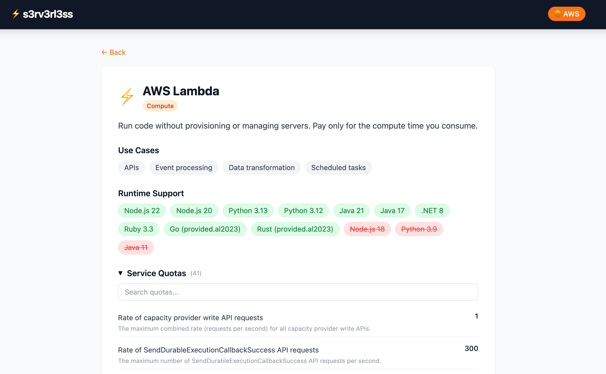

# s3rv3rl3ss

Runtimes, limits, quotas and news for AWS serverless services — updated daily.





Live at [s3rv3rl3ss.olcortesb.com](https://s3rv3rl3ss.olcortesb.com/)

## Tech Stack

- Vue 3 + Vite
- Tailwind CSS
- Vue Router
- Fuse.js (fuzzy search)
- AWS Amplify (hosting)

## Data

The file `src/data/services-aws.json` is generated and committed automatically by the [s3rv3rl3ss-backend](https://github.com/olcortesb/s3rv3rl3ss-backend) pipeline, which runs daily and collects data from three sources:

- Quotas via [Service Quotas API](https://docs.aws.amazon.com/servicequotas/2019-06-24/apireference/API_ListServiceQuotas.html)
- News via [AWS What's New RSS](https://aws.amazon.com/about-aws/whats-new/recent/feed/)
- Runtimes via [AWS Docs](https://docs.aws.amazon.com/lambda/latest/dg/lambda-runtimes.html)

To add or enable a service, edit `src/collector/services.py` in the backend repo. See the [backend README](https://github.com/olcortesb/s3rv3rl3ss-backend) for details.

## Development

```bash
nvm use 20
npm install
npm run dev
```

## Deploy

Connected to AWS Amplify — auto-deploys on push.
